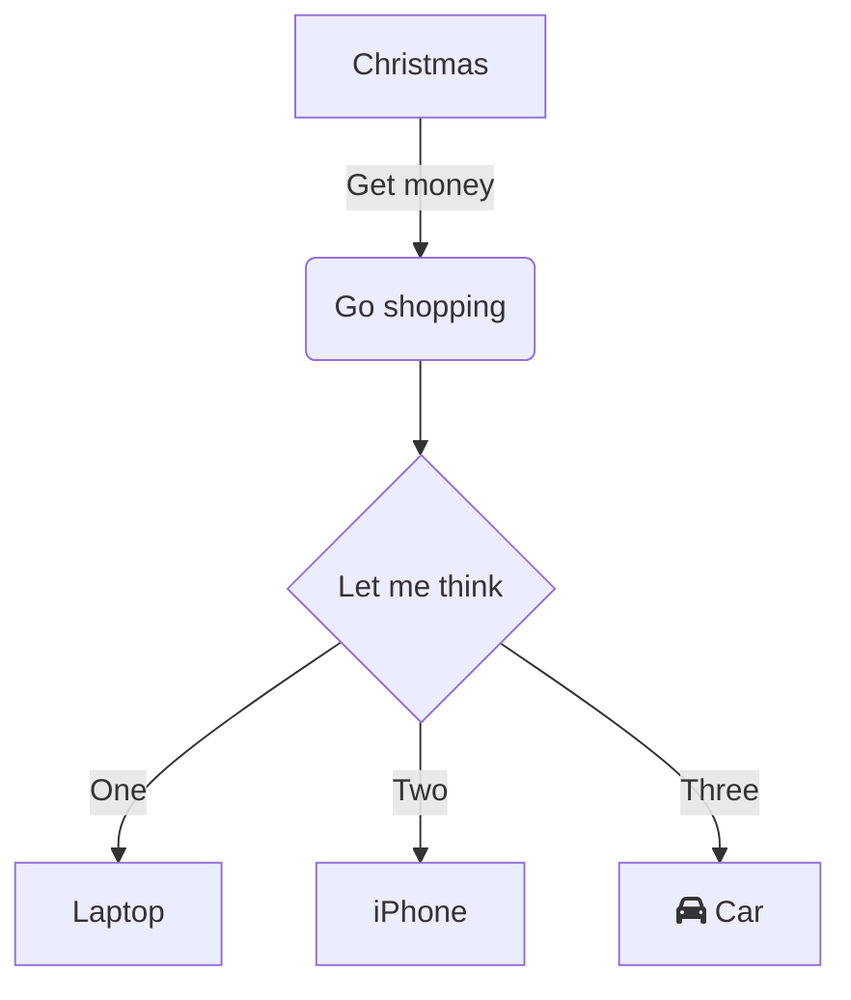

# Projeto Cadastro clientes
Projeto exemplo para cadastro de clientes

## Tecnologia
* Java 20
* JavaFX
* Postgresql 15.3
## Instalação
Para instalação do banco de dados, instalar Postgres 15.3, depois disso, instalar o
administrador de banco de dados DBeaver, criar uma data base chamada "trabalhoFinal",
abrir e executar o script anexo ao projeto.

Para execução do programa, abrir a package Trabalho-final e excutar com o Intellij.

